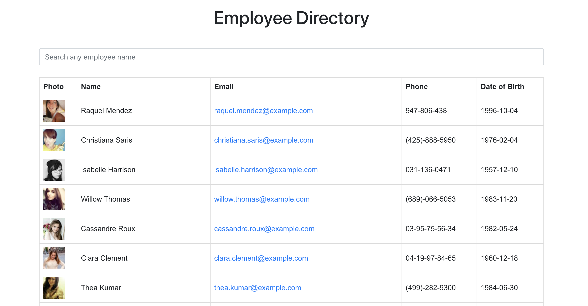

# Employee-Directory
This React application allows managers to quickly filter through non-sensitive data to find employees contact information.

## Table of Contents
1. [About](#about)
2. [Languages Used](#languages)
3. [Contributing](#contribute)
4. [Access & Appearance](#access) 

## About 

This is a simple react application that searches and displays a group of (random) employees pulled from the random user api.

## Languages and Technologies Used 

- React.js
- Random User API
- HTML
- CSS

## Contributing 

If you are interested in contributing to this project, feel free to fork this repository and open a pull request to suggest changes.

## Access and Appearance 

<a href="https://kmvanneste.github.io/Employee-Directory/" target="_blank">LINK to application</a>

